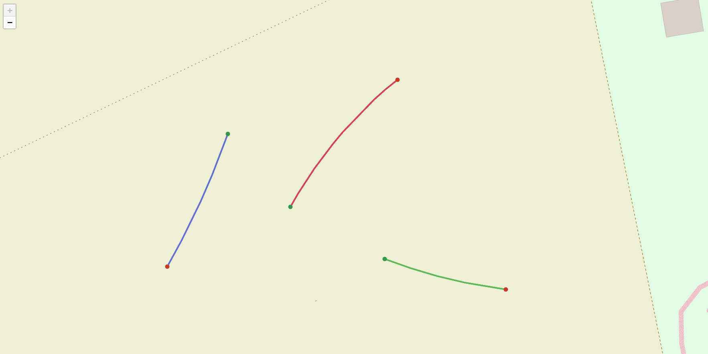
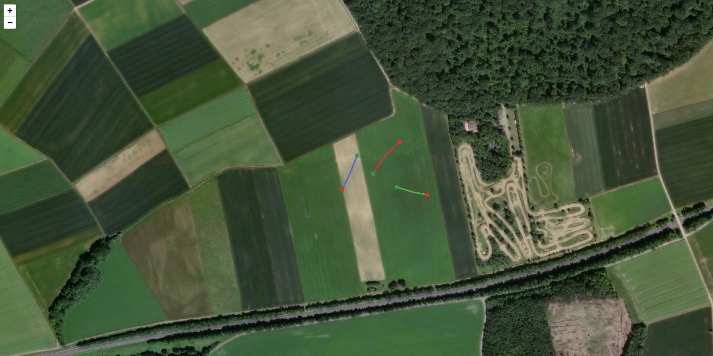

# Drone Vehicle Tracking

Detect, track and **geo-reference** moving vehicles from nadir drone video, then
plot their real-world paths (WGS84) on an interactive map. Built around the
per-frame flight telemetry embedded in DJI `.SRT` files.

> Status: end-to-end pipeline implemented and tested (telemetry -> detect ->
> track -> geo-reference -> smooth -> map / GeoJSON / CoT). Accuracy is
> **relative sub-metre / absolute GNSS-bound**; camera intrinsics are nominal,
> not GCP-calibrated. See [Accuracy](#accuracy).

## Demo



The map is rendered from **synthetic tracks** (no real flight data), so the demo
is fully reproducible without the gitignored video/telemetry or detector weights:

```bash
python examples/make_demo.py   # writes examples/demo_map.html — open it in a browser
```

It draws moving vehicles (solid coloured paths with start/end markers and
speed/confidence/accuracy popups) and a parked one (faint grey dashed), over the
OpenStreetMap and Esri satellite base layers:



## How it works

```
SRT telemetry ─┐
               ├─> stabilize telemetry ─> detect (YOLO) ─> track (ByteTrack) ─> geo-reference ─> smooth ─> map / video
video frames  ─┘
```

1. **Telemetry** — parse DJI SRT into per-frame drone pose (lat, lon, altitude, gimbal).
2. **Stabilization** (optional) — consecutive frames are registered (optical
   flow + RANSAC; moving vehicles rejected as outliers) and the drone's visual
   ego-motion is fused with the GNSS telemetry through a complementary filter,
   stripping high-frequency position/yaw jitter while staying GNSS-anchored
   (`processing.stabilize`).
3. **Detection** — YOLO restricted to vehicle classes. COCO-pretrained weights
   fail on top-down imagery, so VisDrone-finetuned weights are used (see below).
4. **Tracking** — ByteTrack assigns stable IDs -> per-vehicle pixel trajectories;
   weak tracks are dropped by length and mean detection confidence.
5. **Geo-referencing** — per-frame nadir projection maps each pixel to WGS84
   using the drone position, altitude and gimbal yaw.
6. **Smoothing** — centred moving average over each track's WGS84 coordinates
   suppresses GNSS/pixel jitter (`processing.smoothing_window`, endpoints kept).
7. **Visualization** — interactive folium/Leaflet map + optional annotated video.

See [`docs/approach.md`](docs/approach.md) for the method, assumptions and accuracy notes.

## Install

```bash
pip install -e ".[cv,dev]"   # core + CV/DL + dev tooling
```

The pure-Python core (telemetry, geometry, visualization) installs without the
heavy `cv` extra; `cv` adds OpenCV + Ultralytics for detection/tracking.

## Detection weights

COCO-pretrained YOLO does not recognise vehicles from a nadir (top-down) view —
it is trained on ground-level imagery and returns spurious classes on aerial
frames. The default config therefore expects VisDrone-finetuned weights:

```bash
mkdir -p models
curl -L "https://huggingface.co/mshamrai/yolov8s-visdrone/resolve/main/best.pt?download=true" \
  -o models/yolov8s-visdrone.pt
```

Any Ultralytics-compatible `.pt` can be swapped in via `detection.model` in the
config. Weights are not committed (see `.gitignore`).

## Usage

```bash
dvt --video data/flight.MP4 --srt data/flight.SRT --config configs/default.yaml
```

Writes `outputs/tracks.geojson` (per-vehicle WGS84 `LineString` paths, each with
`mean_speed_kmh`, `mean_confidence` and `position_error_m` properties) and `outputs/map.html`, an interactive folium/Leaflet
map (OSM + satellite layers) with one polyline per vehicle. Moving cars are drawn
as solid coloured paths with start/end markers and popups (displacement, path
length, mean speed); near-stationary (parked) tracks are faint and dashed. Both
outputs are gitignored.

Add `--overlay outputs/annotated.mp4` to also burn the detection boxes and track
IDs onto a copy of the source video for visual QA:

```bash
dvt --video data/flight.MP4 --srt data/flight.SRT --overlay outputs/annotated.mp4
```

Add `--cot outputs/tracks.cot` to also export the tracks as **Cursor-on-Target**
(CoT) XML for TAK (ATAK/WinTAK): one `<event>` per vehicle at its last known
position, with course/speed, callsign and a **per-point geometry-aware**
self-reported horizontal accuracy in the standard `ce` field (computed from the
error budget at each point's altitude and pixel offset, reported per track as the
worst case). See [`docs/approach.md`](docs/approach.md#export-cot--tak).

```bash
dvt --video data/flight.MP4 --srt data/flight.SRT --cot outputs/tracks.cot
```

## Accuracy

Validated without GCPs or RTK by separating the two error sources. **Relative**
(path-shape) accuracy is set by the projection geometry, which is sub-metre across
the operating envelope and adds zero cross-frame error under perfect telemetry
(proven in tests). **Absolute** accuracy is bounded by an analytical error budget
(`geo/error_budget.py`) and is dominated by the platform's GNSS (1–3 m without
RTK) — so sub-metre *absolute* is GNSS-bound and not attainable from telemetry
alone, while *relative* path accuracy is finer. Full budget in
[`docs/approach.md`](docs/approach.md#accuracy).

## Performance

Per-stage timing is built in — the same dependency-injection seams used for
testing double as measurement points, so benchmarking runs the real pipeline with
no extra branches in it:

```bash
dvt --video flight.MP4 --srt flight.SRT --benchmark
```

Prints frames, total wall time, throughput (fps) and a decode/detect/track/project
breakdown. Detection dominates wall time, so `io.frame_stride` is the main lever to
trade frames for throughput. See [`docs/approach.md`](docs/approach.md#performance).

## Project layout

```
src/drone_vehicle_tracking/
  telemetry/   # DJI SRT parsing + shared domain models
  detection/   # YOLO vehicle detector
  tracking/    # ByteTrack wrapper
  geo/         # camera model, GSD, nadir pixel->WGS84 projection, ego-motion fusion
  stabilization/  # frame registration (optical flow) feeding the fusion
  visualization/  # folium map + annotated video
  export/      # Cursor-on-Target (CoT) XML for TAK
  pipeline.py  # orchestration
  cli.py       # entrypoint
tests/         # unit (pure logic) + integration (needs real data)
configs/       # all tunables
```

## Development

```bash
ruff check . && ruff format --check .
mypy
pytest -m "not integration"
```

### Testing strategy

The geometry core is verified with hand-derived expected values, an independent
nadir oracle, property-based tests (Hypothesis) and a geodesic cross-check. The
end-to-end run is pinned by a known-answer test: a detection at the image centre
under a nadir gimbal must geo-reference to the drone's own position. The emitted
`tracks.geojson` is validated against an RFC 7946-shaped JSON Schema so a
structural regression fails a test rather than a downstream consumer.

The pure geo core is also exercised with mutation testing (the surviving mutants
are equivalent — docstrings, type-only casts, immutability flags and boundary
cases that coincide at the tested coordinates):

```bash
mutmut run && mutmut results
```

## Data & privacy

Input video/telemetry are **not** committed (see `.gitignore`). Only a tiny
synthetic SRT fixture lives in the repo for tests.

## License

MIT — see [LICENSE](LICENSE).
